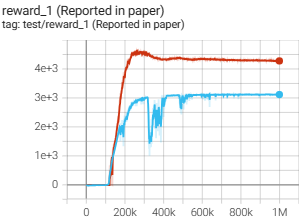
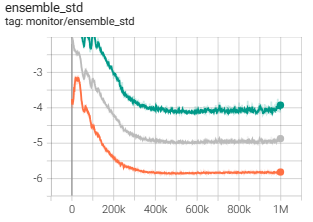
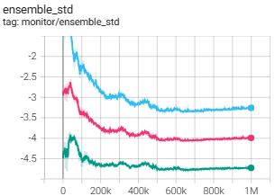

# Offline Model-based Adversarial Game for policy Optimization

## Installation
1. Install [MuJoCo 2.0.0](https://github.com/deepmind/mujoco/releases) to `~/.mujoco/mujoco200`.
2. Create a conda environment and install requirements.
```
cd MAGO
conda env create -f MAGO_env.yml
conda activate MAGO_env
```

## Usage
For example, use the following command to run Hopper-expert-v2 benchmark in D4RL.

```
python main.py --task=hopper-expert-v2
```
Detailed configuration can be found in `config.py`.


#### Logging
By default, TensorBoard logs are generated in the `log/` directory.

## Experiments
We show the comparative experimental results here.

|  Environment   | Dataset  |  MAGO   | PBRL  |  F-BRC   | COMBO  | MOPO   | TD3+BC  | CQL |
|  ----  | ----  |----  | ----  |----  | ----  |----  | ----  |----  | 
|  HalfCheetah   | random  |  35.5±2.3   | 11.0±5.8  |  33.3±1.3   | 38.8±2.1  | 35.4±2.9   | 10.2±1.1  |  35.4±1.5 |
|  HalfCheetah   | medium  |  73.5±1.0   | 57.9±1.5  |  41.3±0.3   | 54.2±8.5  | 42.3±2.4   | 42.8±0.3  | 44.4±0.5 |
|  HalfCheetah   | mixed  |  69.8±1.1   | 45.1±8.0  |  43.2±1.5   | 55.1±6.5  | 53.1±1.1   | 43.3±0.5 | 46.2±0.7 |
|  HalfCheetah   |  med-expert  |  90.8±1.5   |  92.3±1.1  |  93.3±10.2   | 90.0±0.2  |  63.3±21.9  | 95.9±4.3  | 62.4±25.7 |
|  Hopper   | random  |  28.9±2.4   | 26.8±9.3  |  11.3±0.2   | 17.9±16.2  | 11.7±12.2   | 11.0±0.6  | 10.8±0.4 |
|  Hopper   | medium  |  106.8±0.9   | 75.3±31.2  |  99.4±0.3   | 94.9±9.3  |  28.0±34.9   | 98.5±4.2  |  58.0±28.5 |
|  Hopper   | mixed  |  103.3±0.3   | 100.6±1.0  |  35.6±1.0   |  73.1±25.2  |  67.5±9.4   |  31.4±18.8  |  48.6±12.9 |
|  Hopper   |  med-expert  |  105.1±5.2   | 110.8±0.8  |  112.4±0.3   | 111.1±2.6  | 23.7±32.5   | 112.2±9.4  | 98.7±12.9 |
|  Walker2d   | random  |  20.2±0.1   | 8.1±4.4  |  1.5±0.7   |  7.0±5.1  | 13.6±5.7   | 1.4±1.7  | 7.0±1.3 |
|  Walker2d   | medium  |  82.0±0.9   | 89.6±0.7  |  78.8±1.0   | 75.5±2.0  |  11.8±30.8   | 79.7±2.1  |  79.2±17.7 |
|  Walker2d   | mixed  |  79.4±1.1   | 77.7±14.58  |  41.8±7.9   | 56.0±6.4  | 39.0±9.4  | 25.2±5.5  |  26.7±2.7 |
|  Walker2d   |  med-expert  |  104.2±0.9  | 110.1±0.3  |  105.2±3.9   | 96.1±0.2  | 44.6±27.9   |  101.1±0.5  | 111.0±1.6 |

**Table 1** Performance comparison on the D4RL datasets. Each score is normalized based on [10], and averaged over 5 random seeds. ‘±’ represents the standard deviation.


| Environment  | MAGO      | PBRL | MOPO | MOReL |
|--------------|-----------|------|------|-------|
| HalfCheetah  | 95.5±1.7  | 92.4±1.7  | 81.3±21.8 | 8.4±11.8   |
| Hopper  | 112.0±0.5  | 110.5±0.4  | 62.5±29.0 | 80.4±34.9   |
| Walker2d  | 108.9±0.3  | 108.3±0.3  | 62.4±3.2 | 62.6±29.9   |

**Table 2** Normalized scores of three expert tasks. All results are averaged over 5 random seeds.


|  Environment   | Dataset  |  MAGO   | MAGO-no factor |
|  ----  | ----  |----  |----------------|
|  HalfCheetah   | random  |  35.5±2.3   | 30.2±5.8       |
|  HalfCheetah   | medium  |  73.5±1.0   | 65.9±3.5       |
|  HalfCheetah   | mixed  |  69.8±1.1   | 53.1±8.0       |
|  HalfCheetah   |  med-expert  |  90.8±1.5   | 86.2±5.1       |
|  Hopper   | random  |  28.9±2.4   | 24.5±2.3       |
|  Hopper   | medium  |  106.8±0.9   | 95.0±4.2       |
|  Hopper   | mixed  |  103.3±0.3   | 98.6±1.0       |
|  Hopper   |  med-expert  |  105.1±5.2   | 85±0.8         |
|  Walker2d   | random  |  20.2±0.1   | 18.2±4.4       |
|  Walker2d   | medium  |  82.0±0.9   | 80.1±0.7       |
|  Walker2d   | mixed  |  79.4±1.1   | 75.3±3.5       |
|  Walker2d   |  med-expert  |  104.2±0.9  | 100.3±2.1      |

**Table 3** Ablation study on the D4RL datasets. ‘±’ represents the standard deviation.


We show the experimental result figures here.


**HalfCheetah-expert**


**HalfCheetah-random**




**HalfCheetah-medium**


**HalfCheetah-medium-expert**


**HalfCheetah-medium-replay**


**Hopper-expert**


**Hopper-random**


**Hopper-medium**


**Hopper-medium-expert**





**Hopper-medium-replay**





**Walker2d-expert**


**Walker2d-random**


**Walker2d-medium**


**Walker2d-medium-expert**


**Walker2d-medium-replay**


